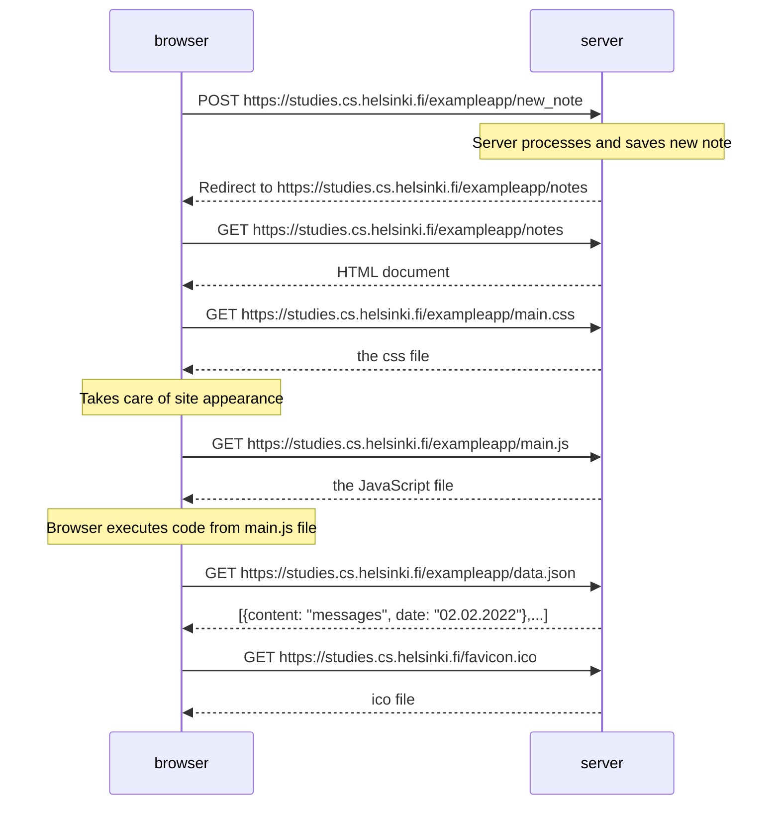

## 0.4

```mermaid
sequenceDiagram
participant browser
participant server

browser->>server: POST https://studies.cs.helsinki.fi/exampleapp/new_note
Note over server: Server processes and saves new note
server-->>browser: Redirect to https://studies.cs.helsinki.fi/exampleapp/notes
browser->>server: GET https://studies.cs.helsinki.fi/exampleapp/notes
server-->>browser: HTML document
browser->>server: GET https://studies.cs.helsinki.fi/exampleapp/main.css
server-->>browser: the css file
Note over browser: Takes care of site appearance
browser->>server: GET https://studies.cs.helsinki.fi/exampleapp/main.js
server-->>browser: the JavaScript file
Note over browser: Browser executes code from main.js file
browser->>server: GET https://studies.cs.helsinki.fi/exampleapp/data.json
server-->>browser: [{content: "messages", date: "02.02.2022"},...]
browser->>server: GET https://studies.cs.helsinki.fi/favicon.ico
server-->>browser: ico file
```
