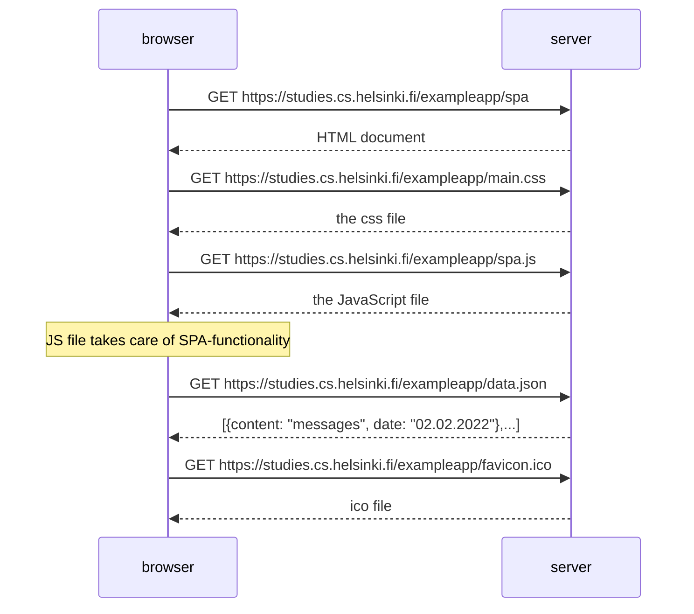

## 0.5

```mermaid
sequenceDiagram 
participant browser
participant server
browser->>server: GET https://studies.cs.helsinki.fi/exampleapp/spa
server-->>browser: HTML document
browser->>server: GET https://studies.cs.helsinki.fi/exampleapp/main.css
server-->>browser: the css file
browser->>server: GET https://studies.cs.helsinki.fi/exampleapp/spa.js
server-->>browser: the JavaScript file
Note over browser: JS file takes care of SPA-functionality
browser->>server: GET https://studies.cs.helsinki.fi/exampleapp/data.json
server-->>browser: [{content: "messages", date: "02.02.2022"},...]
browser->>server: GET https://studies.cs.helsinki.fi/exampleapp/favicon.ico
server-->>browser: ico file
```
