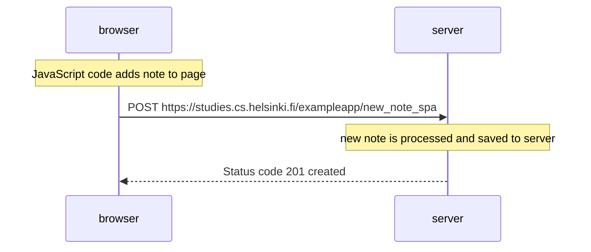

## 0.6

```mermaid 
sequenceDiagram
participant browser
participant server
Note over browser: JavaScript code adds note to page
browser->>server: POST https://studies.cs.helsinki.fi/exampleapp/new_note_spa
Note over server: new note is processed and saved to server
server-->>browser: Status code 201 created 

```
